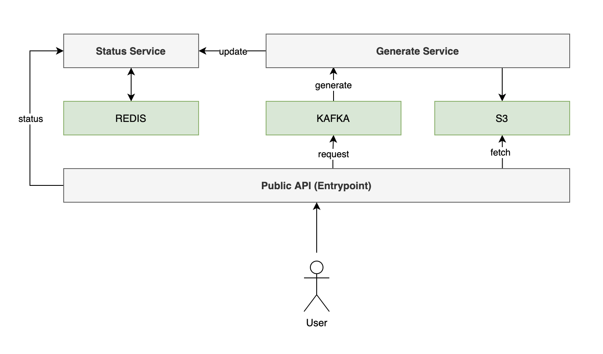

# QR Code Generator

## Overview

This project provides an RESTful API to generate QR codes.

**Roadmap**


Figure 1. QR Code Generator Architecture

<br/>

This project uses a microservice architecture and will consist of 3 services:
- API Entrypoint
- Generate Service
- Status Service

## Deployment

### Local Deployment (Docker Compose)

To deploy this project using docker-compose, complete the following steps:

```bash
docker compose build
docker compose up

# The app is now running on port 8000. To quit, enter Ctrl+C.

docker compose down
```

### Deployment (Helm Charts)

Coming Soon!

## Instructions

Coming soon!
