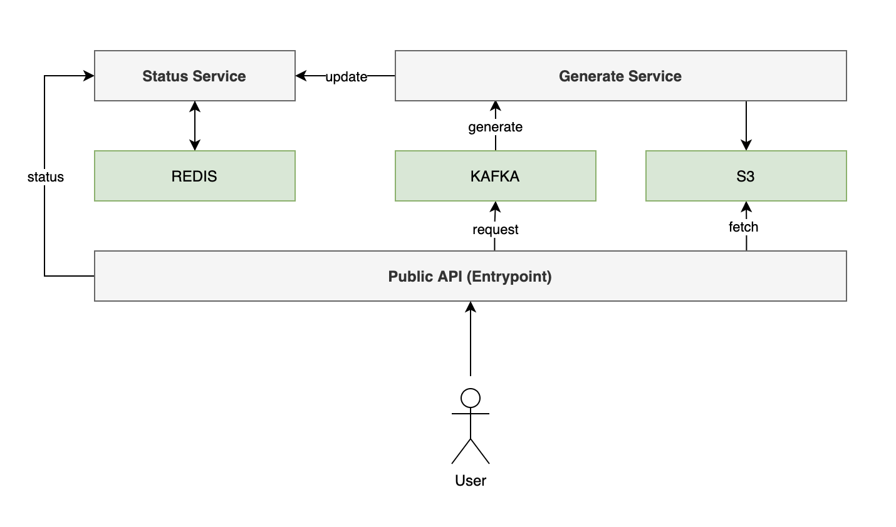

# QR Code Generator

## Overview

This project provides an RESTful API to generate QR codes.

**Roadmap**

Figure 1. QR Code Generator Architecture

 

This project uses a microservice architecture and will consist of 3 services:
- API Entrypoint
- Generate Service
- Status Service

## Documentation

- [API Endpoints](./docs/api-endpoints.md)
- [Deployment](./docs/deployment.md)
- [Testing](./docs/testing.md)
